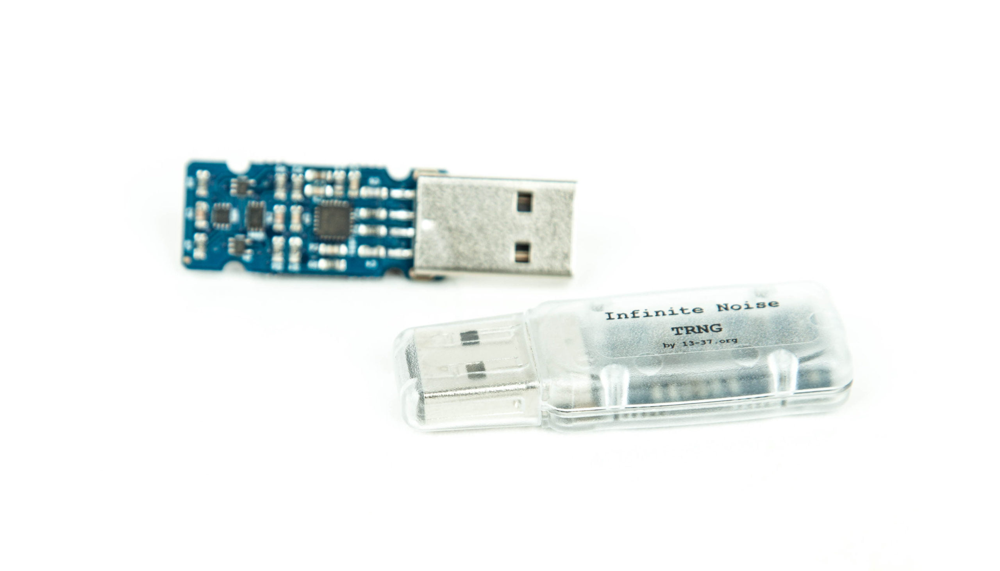
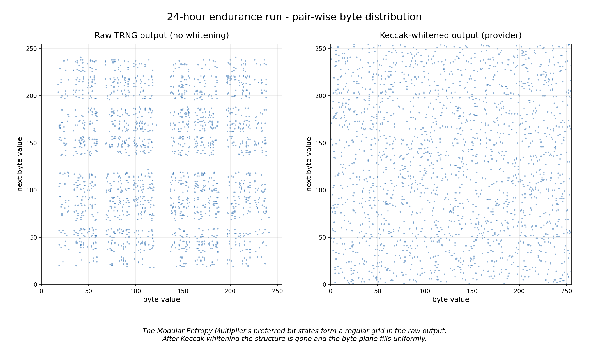
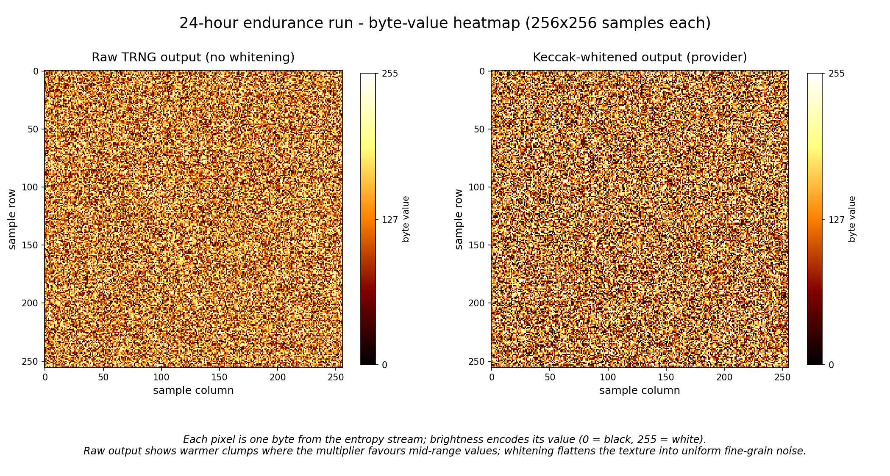

# infnoise-provider

[](https://github.com/Strykar/infnoise-provider/actions/workflows/build.yml)
[](https://github.com/Strykar/infnoise-provider/actions/workflows/cifuzz.yml)
[](https://github.com/Strykar/infnoise-provider/actions/workflows/cppcheck.yml)
[](https://github.com/Strykar/infnoise-provider/actions/workflows/codeql.yml)
[](https://github.com/Strykar/infnoise-provider/actions/workflows/sanitizers.yml)
[](https://www.bestpractices.dev/projects/12494)
[](https://scan.coverity.com/projects/Strykar-infnoise-provider)
[](https://en.wikipedia.org/wiki/C_(programming_language))
[](LICENSE)

<p align="center">
  <br>
  <sub>Photo: <a href="https://leetronics.de/en/shop/infinite-noise-trng/">leetronics.de</a></sub>
</p>

OpenSSL 3.x [provider](https://docs.openssl.org/3.4/man7/provider) for the [Infinite Noise TRNG](https://github.com/waywardgeek/infnoise) USB hardware random number generator.

This provider registers an `OSSL_OP_RAND` seed source backed by the Infinite Noise TRNG, a USB true random number generator based on modular entropy multiplication.  When configured as the DRBG seed source, all OpenSSL cryptographic operations (key generation, signatures, TLS handshakes) are seeded with hardware entropy.

Written from scratch for the OpenSSL 3.x Provider API.  A legacy `ENGINE` implementation by Tim Skipper exists at [tinskip/infnoise-openssl](https://github.com/tinskip/infnoise-openssl) (dormant since 2020); this provider shares no code with it.

**Independent implementation.** This project is not affiliated with or endorsed by the upstream Infinite Noise TRNG project ([waywardgeek/infnoise](https://github.com/waywardgeek/infnoise)) or the vendor I bought it from (https://leetronics.de/en/shop/infinite-noise-trng/).

> **Alpha software** (current tag: `v0.0.1-alpha`).  Passes a 28-test integration harness, five libFuzzer harnesses at 97.9% line coverage, a 24-hour endurance run, and the ASan / UBSan / TSan / allocator-failure sanitiser matrix — but has not been **independently** audited.  Do not use this to seed production key material without your own review.  See [SECURITY.md](SECURITY.md) for the disclosure policy, [docs/Security_Review.txt](docs/Security_Review.txt) for the brief prepared for an external reviewer, and [docs/TODO.txt](docs/TODO.txt) for the path to beta.

## Requirements

- **OpenSSL 3.x** (tested with 3.4+)
- **libinfnoise (patched fork)** and its dependency **libftdi1**.  The provider requires a libinfnoise build whose header defines `INFNOISE_KECCAK_STATE_SIZE` — per-context Keccak/health state and signed-`int32_t` `readData()` return.  The build will fail with a clear `#error` if linked against the unpatched [waywardgeek/infnoise](https://github.com/waywardgeek/infnoise) upstream.
- **Infinite Noise TRNG** USB device connected
- **GCC** with C11 support
- **pkg-config** (used by the Makefile to locate libcrypto and libftdi1)
- Linux (tested on Arch Linux; should work on any distro with the above)

### Arch Linux

```sh
# libftdi1 is in the official repos
pacman -S libftdi openssl pkgconf

# Patched libinfnoise from the Strykar/infnoise fork.
# Upstream waywardgeek/infnoise (and any AUR package built from it)
# is unpatched and will fail this provider's compile-time guard.
git clone --branch libinfnoise-error-codes \
    https://github.com/Strykar/infnoise /tmp/infnoise
make -C /tmp/infnoise/software -f Makefile.linux libinfnoise.so
sudo make -C /tmp/infnoise/software -f Makefile.linux PREFIX=/usr install-lib
sudo ldconfig
```

### Debian / Ubuntu

```sh
apt install libftdi1-dev libssl-dev pkg-config build-essential

# Patched libinfnoise from source — same Strykar/infnoise branch.
git clone --branch libinfnoise-error-codes \
    https://github.com/Strykar/infnoise /tmp/infnoise
make -C /tmp/infnoise/software -f Makefile.linux libinfnoise.so
sudo make -C /tmp/infnoise/software -f Makefile.linux PREFIX=/usr install-lib
sudo ldconfig
```

## Building

```sh
make
```

This produces `infnoise.so` — a hardened shared library (Full RELRO, stack canary, CET/IBT, NX, PIE, stripped).

To install into the OpenSSL modules directory (typically `/usr/lib/ossl-modules/`):

```sh
sudo make install
```

Optional — build and install the manpage (requires `pandoc`):

```sh
make man
sudo make install-man   # → /usr/share/man/man7/OSSL_PROVIDER-infnoise.7
man OSSL_PROVIDER-infnoise
```

## Configuration

Copy or symlink `conf/infnoise-provider.cnf` and point OpenSSL at it:

```sh
export OPENSSL_CONF=conf/infnoise-provider.cnf
```

Or append the relevant sections to your system `/etc/ssl/openssl.cnf`:

```ini
[provider_sect]
default = default_sect
infnoise = infnoise_sect

[default_sect]
activate = 1

[infnoise_sect]
module = /usr/lib/ossl-modules/infnoise.so
activate = 1

[random_sect]
seed = infnoise
```

## Verifying the hardware

Confirm the TRNG is detected:

```sh
# List USB devices — should show "13-37.org / Infinite Noise TRNG"
lsusb | grep 0403:6015

# Quick test with the infnoise CLI (from upstream package)
infnoise --list-devices
```

Verify the provider loads and generates entropy:

```sh
# Check provider is recognized
openssl list -providers -provider-path /usr/lib/ossl-modules -provider infnoise

# Generate random bytes through the provider
OPENSSL_CONF=conf/infnoise-provider.cnf openssl rand -hex 64

# Statistical quality check (requires ent)
OPENSSL_CONF=conf/infnoise-provider.cnf openssl rand 1000000 | ent
```

Generate keys using hardware entropy:

```sh
OPENSSL_CONF=conf/infnoise-provider.cnf openssl genrsa 4096
OPENSSL_CONF=conf/infnoise-provider.cnf openssl genpkey -algorithm EC -pkeyopt ec_paramgen_curve:P-256
```

## Testing

The test arsenal:

- `make test` — 28-test integration harness across 5 layers (hardware, provider API, integration, statistical, memory safety).
- `make test-asan` / `test-ubsan` / `test-valgrind` — sanitiser builds against the integration harness.
- `make test-tsan` — ThreadSanitizer concurrency stress, 4 threads × 20 000 iterations × 2 scenarios. No hardware needed.
- `make test-alloc` — `CRYPTO_set_mem_functions` failure injection at four alloc sites. No hardware needed.
- `make fuzz FUZZ_CC=clang` — five libFuzzer harnesses (dispatch / params / ossl_params / spill_oracle / provider_init) under `fuzz/`. Coverage 280 of 286 lines (97.9%); 22 of 23 functions ≥ 90%. See [docs/Fuzz_Coverage.txt](docs/Fuzz_Coverage.txt).
- `make test-soak` / `test-soak-short` — 24-hour / 1-hour endurance run through the provider; details below.
- `make lint` — cppcheck + `gcc -fanalyzer` static analysis.
- `make sbom` — SPDX-2.3 software bill of materials at `sbom.spdx.txt`.

See [docs/Testing.txt](docs/Testing.txt) for invocations and the per-layer breakdown.

### 24-hour endurance run

`make test-soak` drove `EVP_RAND` continuously for 24 hours: 14 698 generate calls, 4.21 GiB produced (49.9 KiB/s sustained), 0 errors, 95 instantiate / uninstantiate cycles.  RSS peaked at +1.2 MiB and ended 1.0 MiB below start — bounded growth, no leaks.

The two plots below visualise the same entropy stream from two angles.  The pair-wise scatter is the most striking: raw TRNG output exposes the Modular Entropy Multiplier's preferred bit states as a regular grid; after Keccak whitening the structure is gone and the byte plane fills uniformly.



The byte-value heatmap shows each byte as a coloured pixel (0 black → 255 white).  Raw output has warmer clumps where the multiplier favours mid-range values; whitening flattens the texture into uniform fine-grain noise.



## USB permissions

By default, the FTDI device requires root access.  To use without root, create a udev rule:

```sh
# /etc/udev/rules.d/75-infnoise.rules
SUBSYSTEM=="usb", ATTRS{idVendor}=="0403", ATTRS{idProduct}=="6015", \
  GROUP="plugdev", MODE="0664", TAG+="uaccess"
```

Then reload udev and add your user to the group:

```sh
sudo udevadm control --reload-rules
sudo usermod -aG plugdev $USER
# Log out and back in for group change to take effect
```

## Project layout

```
infnoise-provider/
  src/infnoise_prov.c        Provider implementation
  tests/test_infnoise_prov.c  Test harness (28 tests)
  tests/test_infnoise_tsan.c  ThreadSanitizer concurrency stress (make test-tsan)
  tests/test_infnoise_alloc.c Allocator-failure injection test (make test-alloc)
  tests/test_infnoise_soak.c  24-hour soak: drives EVP_RAND through every
                             spill-buffer phase, cycles instantiate/
                             uninstantiate, tracks RSS for leaks, dumps
                             rolling samples for ent/rngtest/dieharder
  fuzz/fuzz_*.c              5 libFuzzer harnesses (see docs/Fuzz_Coverage.txt)
  fuzz/mock_libinfnoise.c    Hardware stub for fuzz/test builds
  fuzz/corpus/<harness>/     Persistent fuzz corpus, committed for replay
  fuzz/regressions/          Inputs that triggered fixed bugs (replayed by CI)
  conf/infnoise-provider.cnf OpenSSL configuration
  conf/openssl.supp          Valgrind suppressions
  docs/ARCHITECTURE.txt       Design decisions and security analysis
  docs/Build_Security.txt     Binary hardening + runtime security properties
  docs/CONTRIBUTING.txt       Contribution guidelines
  docs/Fuzz_Coverage.txt      Per-function fuzz coverage report
  docs/OSSL_PROVIDER-infnoise.7.md
                             Pandoc source for the section-7 manpage
  docs/Security_Review.txt    Brief for an external cryptographic reviewer
  docs/Testing.txt            Test harness layers and invocations
  docs/TODO.txt               Deferred work toward beta
  .github/                   Issue and pull-request templates
  .editorconfig              Editor style rules
  SECURITY.md                Vulnerability disclosure policy
  CODE_OF_CONDUCT.md         Contributor Covenant 2.1
  Makefile                   Build system
  LICENSE                    GPL-2.0-or-later
```

## Security

Full binary hardening (RELRO, stack canary, CET/IBT, NX, PIE, FORTIFY_SOURCE=3, stripped), entropy-buffer cleansing on all paths, secure-heap seed allocation (`OPENSSL_secure_malloc` — `mlock`'d when the application initialises OpenSSL's secure heap before the first call; see [docs/ARCHITECTURE.txt §5](docs/ARCHITECTURE.txt)), bounded request sizes, and thread-safe dispatch.  See [docs/Build_Security.txt](docs/Build_Security.txt) for the full list and [docs/ARCHITECTURE.txt](docs/ARCHITECTURE.txt) for the design rationale.  Vulnerability disclosure: [SECURITY.md](SECURITY.md).  Maintainer / signing model: [docs/Governance.txt](docs/Governance.txt).

## Known limitations

- **One open handle per physical device.** FTDI USB exclusion applies regardless of provider configuration; multiple `EVP_RAND_CTX` instances against the same TRNG would race for the device.  The provider serialises a single shared context via `CRYPTO_RWLOCK`.
- **Throughput ~50 KB/s** (USB bulk transfer speed bound).  Suitable for seeding DRBGs and key generation; not suitable for bulk random data production.

## Contributing

Patches, bug reports, and feature proposals are welcome.  See [docs/CONTRIBUTING.txt](docs/CONTRIBUTING.txt) for style, build / test expectations, and the security invariants that any change must preserve.  All participation is governed by the [Code of Conduct](CODE_OF_CONDUCT.md).

For suspected vulnerabilities, please follow [SECURITY.md](SECURITY.md) rather than opening a public issue.

## License

GPL-2.0-or-later.  See [LICENSE](LICENSE) for details.

This provider links OpenSSL (Apache 2.0).  Pure GPL-2.0 is incompatible with Apache 2.0; the "or later" clause elevates the effective license to GPL-3.0 at distribution time, which is explicitly Apache-2.0-compatible.

Copyright (C) 2025-2026 Avinash H. Duduskar.
